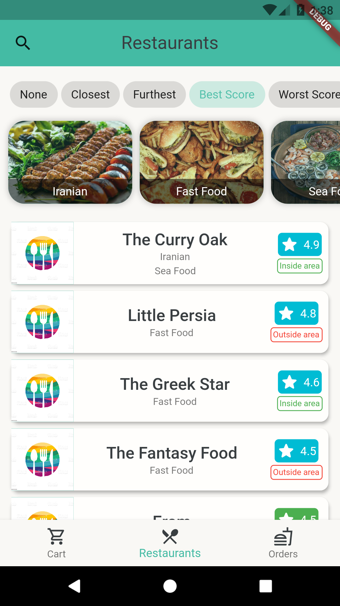
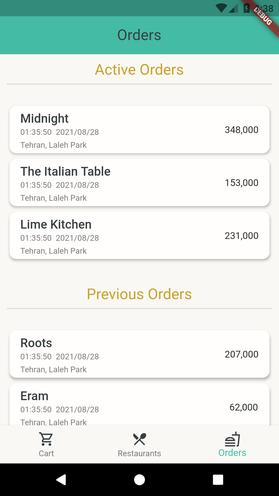

# Savvy Meals
##### A flutter app for ordering food
----

### Description
This is one repository of the four repositories created for the final project of the **Advanced Programming course**, and contains dart code for our 'online' food ordering app. You can download and test the app for android [here](TODO).

---

### Other repositories
You can visit the repository of the restaurant management app here:
[Owner app (Savvy Meals - Managers)](https://github.com/sinatb/ap_project_RESTAURANT)
the project's object models here:
[Models](https://github.com/MeysamBavi/ap-project-models)
and the java server here:
[Server](https://github.com/MeysamBavi/ap-project-server)

---

### Screenshots

---

### About us
We are two CE students from SBU!
[Meysam Bavi](https://github.com/MeysamBavi)
[Sina Taheri](https://github.com/sinatb)
